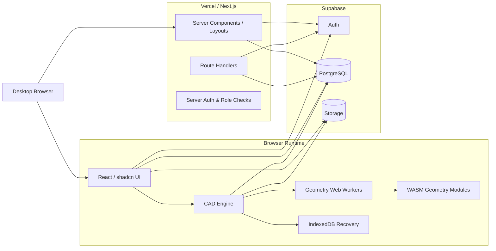
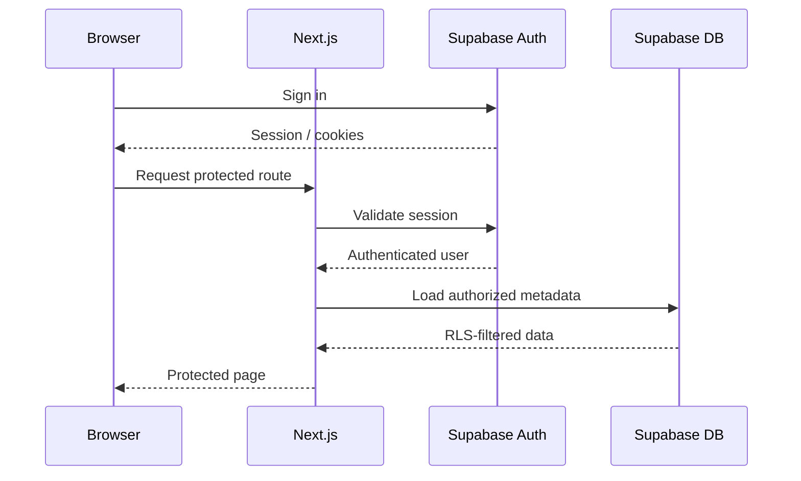
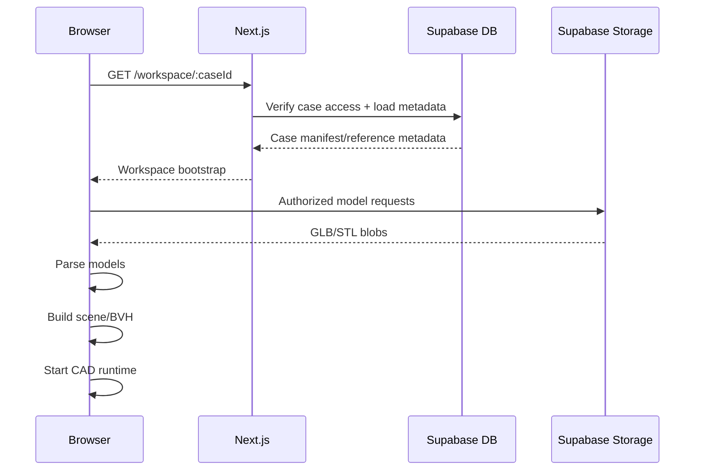
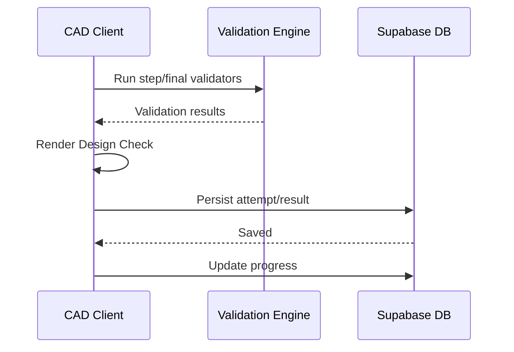
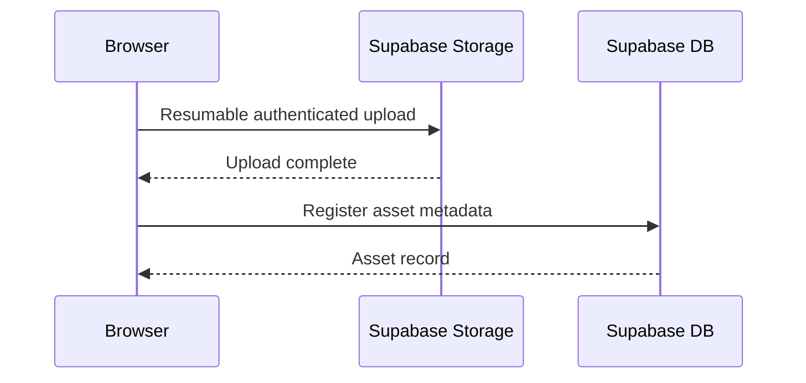

# Prostheia — Technical Architecture & Implementation Document

> **Document:** `TECH.md`  
> **Product:** Prostheia — Digital Dental Design Studio  
> **Source documents:** `plan.md`, `PRD.md`  
> **Status:** Technical architecture baseline  
> **Purpose:** Define how Prostheia will be built, how its systems communicate, which technologies and external services are used, how authentication/authorization work, how CAD state is processed and persisted, and how the application is deployed.  
> **Related future document:** `DB.md`

---

# 1. Architecture Summary

Prostheia will be implemented as a **desktop-first browser CAD application** built with Next.js and TypeScript.

The core architectural rule is:

> **Interactive CAD geometry runs in the browser. Cloud services persist identity, content, files, progress and project revisions.**

The application must not send every tooth movement, sculpt stroke, collision check, or analysis operation to a remote backend. Those operations must remain local so that the editor feels immediate and remains usable with complex 3D geometry.

The platform is divided into five major technical areas:

1. **Next.js application shell**
   - routing;
   - authenticated layouts;
   - dashboard;
   - Practice;
   - Free Lab;
   - Admin;
   - server-side authorization checks.

2. **Browser CAD engine**
   - Three.js rendering;
   - scene/object management;
   - selection;
   - transforms;
   - mesh editing;
   - sculpting;
   - geometric analysis;
   - articulator;
   - history;
   - import/export.

3. **Learning engine**
   - Practice modules;
   - lesson steps;
   - tool restrictions;
   - contextual help;
   - reference models;
   - validation;
   - scores;
   - skill progress.

4. **Supabase platform**
   - authentication;
   - PostgreSQL database;
   - Row Level Security;
   - 3D model and revision storage;
   - content assets;
   - project metadata.

5. **Vercel deployment**
   - Next.js hosting;
   - server rendering;
   - route handlers;
   - edge/CDN delivery for application assets.

No Python production service is required for the baseline architecture.

---

# 2. Architecture Goals

The architecture must optimize for:

- low-latency CAD interaction;
- reusable CAD tools across Practice and Free Lab;
- strong separation between UI state and heavy geometry;
- safe user-owned project storage;
- secure admin content management;
- realistic 3D models;
- reliable undo/recovery;
- incremental expansion without replacing the editor;
- understandable code organization;
- portfolio-grade engineering quality.

The architecture must avoid:

- a separate Practice editor and Free Lab editor;
- storing giant `BufferGeometry` objects inside React state;
- sending geometry to the server for every interactive operation;
- proxying large model uploads through Vercel Functions;
- using Supabase `service_role` in browser code;
- treating STL as the internal project state format;
- hardcoding every lesson as a separate React page;
- placing domain validation directly inside page components.

---

# 3. Technology Stack

## 3.1 Core Application

| Area | Technology | Purpose |
|---|---|---|
| Framework | Next.js + App Router | Application shell, routes, server rendering, API/route handlers |
| Language | TypeScript | Type-safe application and CAD engine |
| UI | React | Application UI |
| Styling | Tailwind CSS | Layout and visual styling |
| Components | shadcn/ui | Buttons, dialogs, menus, tooltips, popovers, forms, panels |
| 3D | Three.js | Core renderer and geometry representation |
| React 3D | `@react-three/fiber` | React renderer around Three.js |
| 3D helpers | `@react-three/drei` | Controls and reusable R3F helpers |
| CAD state | Zustand | Fast client-side editor/UI state |
| Database/Auth/Storage | Supabase | Identity, Postgres, RLS, file storage |
| Hosting | Vercel | Next.js deployment |

---

## 3.2 Geometry and Performance

Preferred supporting libraries:

| Technology | Purpose |
|---|---|
| `three-mesh-bvh` | Accelerated raycasting, closest-point queries, intersections, spatial selection |
| Manifold WASM | Robust solid boolean operations for suitable manifold meshes |
| Web Workers | Expensive geometry processing off the main UI thread |
| IndexedDB | Local crash/recovery snapshots |
| Zod | Runtime validation for manifests/API/configuration |
| Three.js loaders/exporters | STL/OBJ/PLY/GLB import/export where supported |

Exact package versions must be pinned when the repository is initialized.

Do not use loose `latest` dependencies in production.

### Phase 1 compatibility baseline

The initial lockfile uses Next.js `16.3.6`, React `19.2.8`, TypeScript `5.9.3`,
Three.js `0.186.1`, React Three Fiber `9.8.1`, Drei `10.7.8`,
`three-mesh-bvh` `0.9.15`, and Node.js `22.12.0`. R3F 9 supports React 19 and
the selected Three.js release is within the peer ranges published by Fiber,
Drei, and `three-mesh-bvh`.

The maintained browser/WASM candidate checked for boolean work is
`manifold-3d` `3.5.3` (Apache-2.0). Its package metadata exposes ESM and WASM
entry points and the Manifold guide describes execution in modern browsers.
It is not installed in Phase 1: Next.js/Turbopack asset loading and worker
initialization have not yet been exercised in this project. Add it when the
boolean-operation phase can verify lazy WASM loading in the intended worker
boundary.

---

# 4. Required External Services

The required hosted services are intentionally minimal.

## 4.1 Supabase

Used for:

- Auth;
- PostgreSQL;
- Row Level Security;
- Storage;
- content metadata;
- Practice progress;
- project revision metadata;
- admin content.

Supabase is the primary application backend.

---

## 4.2 Vercel

Used for:

- Next.js hosting;
- Server Components;
- Route Handlers;
- application CDN;
- preview deployments;
- production deployment.

Large 3D uploads should go **directly from the browser to Supabase Storage**, not browser → Vercel → Supabase.

---

## 4.3 Optional Later Services

Not required for initial production architecture:

- Sentry for client/server error telemetry;
- dedicated analytics platform;
- background processing infrastructure;
- external CAD backend;
- AI services.

Do not add another hosted dependency unless it solves a concrete problem.

---

# 5. High-Level System Diagram



---

# 6. Core Runtime Boundary

The system must deliberately distinguish:

## Runs on Next.js server

- page-level authentication checks;
- admin role checks;
- loading initial case/lesson metadata;
- privileged administrative actions;
- generation of protected upload/download actions when necessary;
- validation of metadata payloads;
- content publication operations;
- secure operations requiring elevated credentials.

## Runs in browser

- Three.js rendering;
- camera;
- object picking;
- transforms;
- mesh editing;
- sculpting;
- measurements;
- contact/deviation computation;
- most CAD validation;
- articulator animation;
- history;
- local recovery;
- file parsing;
- direct Storage upload/download.

## Runs in Web Workers

- BVH building for large meshes;
- expensive closest-point/deviation queries;
- mesh validation;
- mesh repair operations where supported;
- expensive sculpt updates if practical;
- boolean calls through WASM;
- serialization/export when it would block the UI.

---

# 7. Repository Structure

Recommended project layout:

```text
prostheia/
├── app/
│   ├── (marketing)/
│   │   └── page.tsx
│   │
│   ├── (auth)/
│   │   ├── login/
│   │   └── signup/
│   │
│   ├── (app)/
│   │   ├── layout.tsx
│   │   ├── dashboard/
│   │   ├── practice/
│   │   ├── free-lab/
│   │   ├── cases/
│   │   ├── progress/
│   │   └── workspace/
│   │       └── [caseId]/
│   │
│   ├── admin/
│   │   ├── layout.tsx
│   │   ├── lessons/
│   │   ├── scenarios/
│   │   ├── models/
│   │   └── validations/
│   │
│   └── api/
│       ├── uploads/
│       ├── exports/
│       ├── admin/
│       └── cases/
│
├── components/
│   ├── ui/
│   ├── app-shell/
│   ├── practice/
│   ├── admin/
│   └── cad-ui/
│
├── cad/
│   ├── engine/
│   ├── scene/
│   ├── camera/
│   ├── selection/
│   ├── transform/
│   ├── geometry/
│   ├── sculpt/
│   ├── curves/
│   ├── analysis/
│   ├── articulator/
│   ├── history/
│   ├── import/
│   ├── export/
│   ├── validation/
│   ├── serialization/
│   └── workers/
│
├── practice/
│   ├── engine/
│   ├── validators/
│   ├── scoring/
│   └── types/
│
├── free-lab/
│   └── engine/
│
├── stores/
│   ├── workspace-store.ts
│   ├── ui-store.ts
│   ├── practice-store.ts
│   ├── history-store.ts
│   └── save-store.ts
│
├── lib/
│   ├── supabase/
│   ├── auth/
│   ├── permissions/
│   ├── storage/
│   ├── i18n/
│   └── validation/
│
├── types/
│
├── public/
│
├── supabase/
│   ├── migrations/
│   ├── seed.sql
│   └── tests/
│
└── tests/
    ├── unit/
    ├── geometry/
    ├── integration/
    └── e2e/
```

This is a starting architecture, not a requirement that every folder exist on day one.

---

# 8. Next.js Application Architecture

Use the App Router.

## 8.1 Server Components by Default

Pages that primarily load metadata should remain Server Components.

Examples:

- Dashboard;
- Practice module list;
- scenario list;
- Progress;
- admin listing pages.

Benefits:

- smaller client bundle;
- server-side access checks;
- simpler initial data loading.

---

## 8.2 CAD Workspace as Client Boundary

The CAD editor itself must be a client-side subsystem.

Recommended pattern:

```text
workspace/[caseId]/page.tsx
    ↓
Server:
- validate session
- validate case access
- load bootstrap metadata
- load lesson/scenario metadata
    ↓
<CadWorkspaceClient bootstrap={...} />
    ↓
Browser CAD runtime
```

Only the workspace subtree should carry the large client-side Three.js/CAD runtime.

Avoid turning the entire authenticated application into a Client Component.

---

## 8.3 Dynamic Loading

The heavy CAD bundle should be dynamically loaded.

Reasons:

- no need to ship Three.js to the Dashboard;
- avoids SSR assumptions for WebGL/browser APIs;
- keeps marketing/auth routes lightweight.

---

# 9. Shared CAD Engine

There is exactly one editor architecture.

```text
CAD ENGINE
├── Renderer
├── Scene Registry
├── Camera
├── Selection
├── Transform
├── Mesh Editing
├── Sculpting
├── Curves
├── Analysis
├── Articulator
├── History
├── Import
├── Export
├── Serialization
└── Validation
```

Practice and Free Lab wrap the same engine.

```text
Shared CAD Engine
      ↑       ↑
 Practice   Free Lab
```

Never fork the editor into two implementations.

---

# 10. CAD State Architecture

A common failure in React 3D applications is putting huge geometry objects in reactive UI state.

Do **not** store full Three.js geometry arrays in Zustand or React state.

Use two separate concepts:

## 10.1 Editor Metadata State

Stored in Zustand.

Examples:

- selected object IDs;
- active tool;
- transforms;
- visibility;
- current camera preset;
- active analysis mode;
- brush settings;
- current Practice step;
- dirty flags;
- save status.

---

## 10.2 Geometry Registry

Heavy Three.js objects live outside normal React state.

Conceptual interface:

```ts
interface GeometryRegistry {
  get(objectId: string): CadObjectRuntime | undefined
  register(object: CadObjectRuntime): void
  remove(objectId: string): void
  markDirty(objectId: string): void
}
```

A runtime object may contain:

```ts
type CadObjectRuntime = {
  id: string
  mesh: THREE.Mesh
  geometryRevision: number
  boundsTree?: MeshBVH
  dirty: boolean
}
```

React state stores the ID/version, not the `Float32Array` vertex data.

For Phase 8, each imported CAD object keeps an immutable map of geometry
revisions outside Zustand. A revision maps stable child-mesh keys to
`BufferGeometry` instances, so GLB child transforms and hierarchy remain
unchanged when one child is edited. The object transform remains independent
from its geometry revision. Workers receive transferable typed arrays and
operation parameters; a validated result is installed as a new revision only
after the worker succeeds.

Mesh history commands pin their before/after revisions. The runtime history
budget is `MAX_MESH_HISTORY_BYTES = 128 MiB` with a 12-command ceiling; oldest
undo commands are released first. The active revision and original imported
revision remain available. A single edit can exceed the history budget when
needed to retain its immediate undo state. Removing an unreferenced revision
disposes its geometry and BVH; revision maps and BVHs are session-only and are
not serialized. Imported and edited geometry still must be re-imported after a
reload until persistent case revisions are implemented in Phase 13.

Geometry operations use indexed canonical triangle data. Non-indexed source
geometry is converted to sequential indices for editing, while source vertex
coordinates and child transforms are preserved. The current renderer builds
three-mesh-bvh trees during idle time for face raycasting and disposes/rebuilds
them as revisions change.

---

# 11. Canonical Coordinate System

Dental files may arrive with inconsistent coordinate orientation.

Prostheia must normalize imported cases into a canonical workspace coordinate system.

Recommended internal convention:

- units: millimetres;
- right-handed coordinates;
- Z = superior/inferior vertical axis;
- X = left/right;
- Y = anterior/posterior.

The import workflow must preserve an `originalToCanonical` transform so exports can optionally respect the original orientation if needed.

Do not assume uploaded STL coordinates are already meaningful.

---

# 12. Internal Asset and Project Format

## 12.1 Raw Uploads

Keep the original user file immutable.

Example:

```text
original.stl
```

The application may derive a canonical processed representation.

---

## 12.2 Internal Geometry Snapshot

Do not use STL as the internal source of truth.

Preferred internal snapshot direction:

- GLB for one or more editable/renderable mesh objects;
- JSON project manifest for domain/editor metadata.

Reasons:

- GLB can contain multiple objects;
- transforms can be represented cleanly;
- normals/material information can be retained;
- binary delivery is efficient;
- project state does not need to be reconstructed from STL filenames.

---

## 12.3 Project Manifest

Conceptual example:

```json
{
  "schemaVersion": 1,
  "caseId": "uuid",
  "coordinateSystem": "prostheia-z-up-mm",
  "objects": [
    {
      "id": "obj-1",
      "role": "maxilla",
      "geometryRevision": "rev-123",
      "position": [0, 0, 0],
      "rotation": [0, 0, 0, 1],
      "scale": [1, 1, 1],
      "visible": true
    }
  ],
  "analysis": {},
  "workflow": {},
  "savedAt": "..."
}
```

Exact schema belongs in `DB.md`/implementation types.

---

# 13. Rendering Architecture

Use Three.js through React Three Fiber.

R3F is used to compose the scene and integrate it with React, while direct Three.js APIs remain available where needed.

The renderer should contain:

```text
Canvas
├── CAD Camera
├── Lighting
├── Grid / reference environment
├── Scene Objects
├── Selection Overlays
├── Transform Gizmos
├── Analysis Overlays
├── Section / clipping helpers
└── Contextual tool overlays
```

---

# 14. Camera and Navigation

Required camera functionality:

- orbit;
- pan;
- zoom;
- standard dental views;
- perspective;
- orthographic;
- frame selected;
- reset view.

Rules:

- camera controls are disabled while a conflicting drag operation is active;
- sculpting should not accidentally orbit the camera;
- transform gizmo drag must suppress orbit;
- standard views must use canonical dental axes.

---

# 15. Scene Registry

Every CAD object must have a stable application ID independent of Three.js UUID.

Example roles:

```text
maxilla
mandible
antagonist
prepared_tooth
tooth
crown
bridge
denture_tooth
denture_base
framework
reference
scan
other
```

Scene metadata determines:

- which tools are available;
- how the object appears in Scene Tree;
- how validators interpret it;
- what can be exported;
- what can be hidden/isolated.

---

# 16. Selection System

Selection should use accelerated raycasting.

Selection states:

- none;
- single object;
- multi-object;
- region/face selection for mesh tools.

The selection subsystem must be independent from Practice logic.

Practice can restrict allowed selections, but should not implement its own picker.

---

# 17. Transform System

Transforms must support:

- gizmo;
- numeric input;
- axis locking;
- snapping;
- fine movement;
- step increments.

Every completed transform operation creates a history command.

Conceptual command:

```ts
type TransformCommand = {
  objectId: string
  before: TransformState
  after: TransformState
}
```

Continuous mouse movement should **not** add hundreds of undo entries.

One drag gesture = one history operation.

---

# 18. Mesh Editing Architecture

Mesh preparation includes:

- trim;
- delete selection;
- smooth;
- fill hole;
- duplicate;
- mirror where meaningful;
- alignment.

Different operations have different topology requirements.

Do not implement them all as one generic “mesh edit” function.

---

# 19. Sculpting Architecture

Sculpting is one of the highest-risk technical features.

Required user tools:

- Add
- Remove
- Smooth
- Flatten
- Morph
- Brush Size
- Brush Strength

---

## 19.1 Picking

Brush intersection:

1. raycast into mesh;
2. find hit point;
3. query nearby triangles/vertices using BVH;
4. compute brush falloff.

---

## 19.2 Add / Remove

Initial implementation strategy:

- displace affected vertices along local/averaged surface normals;
- positive displacement = Add;
- negative displacement = Remove.

This is responsive and works well on sufficiently dense meshes.

Limitation:

> Vertex displacement is not the same as full adaptive remeshing.

Large strokes on a low-density mesh can stretch triangles.

Therefore the engine needs a **mesh-density guard** and eventual remeshing/refinement strategy for high-quality sculpting.

---

## 19.3 Smooth

Use a controlled local smoothing method such as Laplacian/Taubin-style smoothing over the affected neighborhood.

Requirements:

- avoid excessive shrinkage;
- preserve brush falloff;
- recompute normals;
- update spatial acceleration structures.

---

## 19.4 Flatten

Use the brush hit neighborhood to estimate a local plane, then move vertices toward that plane using brush falloff/strength.

---

## 19.5 Morph

Morph is intentionally broader.

Potential implementations:

- push/pull along averaged direction;
- grab-like deformation;
- reference-assisted displacement.

The exact UX should be prototyped before finalizing the algorithm.

---

## 19.6 BVH Updates

Local vertex displacement changes bounds.

After small sculpt changes:

- update vertex buffer;
- update normals;
- refit affected BVH nodes where safe.

After major topology changes:

- rebuild the BVH.

---

# 20. Spatial Acceleration

Use `three-mesh-bvh` for operations such as:

- fast raycasting;
- brush neighborhood queries;
- object intersections;
- closest-point queries;
- deviation analysis;
- lasso/region selection;
- collision candidates.

BVH generation for large geometry should run in a Worker where practical.

Do not rebuild the full BVH on every mousemove.

---

# 21. Boolean Geometry

Use a robust solid boolean library such as Manifold WASM for:

- Union;
- Difference;
- Intersection;

where the input geometry satisfies the necessary solid/manifold conditions.

Important rule:

> Arbitrary dental scan meshes must not automatically be assumed to be valid solid boolean inputs.

Many intraoral/dental scans are open surfaces or contain defects.

Therefore:

- scan trimming may use direct triangle operations/clipping instead of solid boolean;
- generated denture bases and known closed solids are better boolean candidates;
- input should be validated/repaired before boolean operations;
- failures must return understandable errors.

Boolean operations should run in a Worker/WASM boundary.

---

# 22. Analysis Engine

Analysis is implemented as reusable geometry services.

Conceptual modules:

```text
analysis/
├── distance.ts
├── contacts.ts
├── intersections.ts
├── deviation.ts
├── section.ts
├── thickness.ts
├── undercut.ts
├── symmetry.ts
└── occlusion.ts
```

Practice validators consume these modules.

Free Lab visualizations consume the same modules.

---

# 23. Distance Measurement

Basic measurement:

- click first surface point;
- click second surface point;
- display distance in millimetres;
- keep optional measurement annotation.

Angle measurement may use three picked points or two vectors depending on tool mode.

---

# 24. Contact Analysis

Contact visualization compares two surfaces.

Initial algorithm:

1. choose source geometry;
2. query nearest distance to target geometry;
3. classify values using configured thresholds;
4. map class/distance to vertex color.

Threshold configuration is stored with the exercise/material/case.

Example classes:

```text
intersection
strong_contact
near_contact
clearance
```

The calculation should be performed at sufficient resolution for educational use.

For heavy models:

- offer fast preview;
- recalculate full map when user stops moving geometry.

---

# 25. Intersection Detection

Use BVH-to-BVH or accelerated geometry queries.

Required outputs:

- boolean “does intersect”;
- approximate/problem region;
- optional penetration indicators where practical.

The system should avoid expensive full triangle-pair comparisons without spatial pruning.

---

# 26. Reference Deviation

Reference comparison:

1. align user and reference in shared coordinates;
2. query closest distance from sampled/user vertices to reference surface;
3. optionally calculate signed direction where meaningful;
4. map distance to heatmap.

This supports:

- Practice comparison;
- transparent/outline reference;
- educational deviation visualization.

---

# 27. Thickness Analysis

Thickness is technically more complex than simple closest-surface distance.

Possible implementation:

- cast rays along inward/outward normals;
- find opposite surface;
- measure thickness;
- reject ambiguous/open-surface cases.

Thickness must be treated as an advanced analysis feature until tested on representative dental meshes.

The architecture should expose:

```ts
analyzeThickness(mesh, options)
```

even if the implementation is introduced after the earliest milestone.

---

# 28. Undercut / Insertion Path Analysis

Conceptual input:

```text
mesh
insertion direction vector
threshold/configuration
```

Potential algorithm:

- evaluate triangle/vertex orientation relative to insertion direction;
- combine with directional visibility/raycast checks;
- classify surfaces that cannot clear along the selected path;
- visualize result as heatmap.

This algorithm needs domain validation.

Do not reduce “undercut” to a simple backface-color shader and present it as clinically exact.

---

# 29. Section View

Two levels:

## MVP visual section

Use Three.js clipping planes to visually cut the model.

## Advanced section

Calculate explicit cross-section contours/caps where required.

The visual tool should be available before full topology-aware contour generation.

---

# 30. Occlusion Engine

Occlusion combines:

- upper/lower jaw transforms;
- contact analysis;
- collision/intersection detection;
- articulator movement.

The same contact engine should be reused rather than implementing separate static and dynamic contact code.

---

# 31. Virtual Articulator Architecture

The articulator should be a kinematic simulation layer.

Objects are grouped:

```text
upper jaw group
lower jaw group
restorations / teeth attached to each group
```

Supported movements:

- open/close;
- protrusion;
- left lateral;
- right lateral.

The initial system is educational, not patient-specific biomechanics.

Movement parameters should be configurable by scenario/preset.

Use right-handed millimeters throughout the articulator: +X is left, +Y is anterior, and +Z is superior. Keep the upper arch fixed and transform the lower arch relative to its saved reference. Open/close rotates around the configured hinge axis and pivot; protrusion follows +Y; left and right lateral trajectories follow +X and -X. These are deterministic educational trajectories, not patient-specific motion claims. Persist the setup and arch assignments as case metadata.

During motion:

1. update jaw transform;
2. request sampled contact preview through the shared analysis worker and BVH path;
3. report per-sample contact states and progress;
4. reject stale results after target geometry, transforms, or configuration changes;
5. avoid full expensive recomputation every animation frame if unnecessary.

---

# 32. Import Pipeline

Target formats:

- STL
- OBJ
- PLY
- GLB

Implementation pipeline:

```text
File selected
    ↓
Basic validation
    ↓
Worker parse
    ↓
Geometry inspection
    ↓
Object role / arch selection
    ↓
Orientation
    ↓
Unit / scale confirmation if ambiguous
    ↓
Canonical transform
    ↓
Optional cleanup
    ↓
Generate runtime mesh + BVH
    ↓
Create project object
```

---

# 33. File Validation

Validate before accepting a model into a project.

Checks:

- supported extension;
- file size within configurable platform limit;
- parse succeeds;
- geometry contains vertices/faces;
- finite coordinates;
- bounding box is reasonable;
- no NaN/Infinity;
- triangle count within supported memory range.

Do not trust MIME type alone.

---

# 34. Direct Storage Upload

Large model files should upload directly to Supabase Storage.

Preferred approach:

- authenticated client;
- path controlled by RLS;
- resumable/TUS upload for larger files;
- upload progress displayed;
- no Vercel Function acting as binary relay.

This avoids:

- serverless body-size limits;
- serverless execution time;
- unnecessary bandwidth duplication.

---

# 35. Export Pipeline

Exports should run client-side where practical.

Target formats:

- STL;
- OBJ;
- GLB.

Export flow:

```text
Choose Export
    ↓
Choose objects/components
    ↓
Prepare cloned export geometry
    ↓
Apply transforms
    ↓
Serialize in Worker if expensive
    ↓
Download
```

Do not mutate live editor geometry during export.

---

# 36. Practice Engine

Practice is content/configuration interpreted by a reusable runtime.

Conceptual lesson definition:

```ts
type PracticeLesson = {
  id: string
  moduleId: string
  difficulty: "foundation" | "beginner" | "intermediate" | "advanced"
  goal: LocalizedText
  prerequisites: string[]
  steps: PracticeStep[]
  assets: AssetRef[]
  reference?: AssetRef
  validators: ValidationConfig[]
}
```

Step:

```ts
type PracticeStep = {
  id: string
  order: number
  instructions: LocalizedText
  allowedTools: ToolId[]
  hints: Hint[]
  validators: ValidationConfig[]
}
```

---

# 37. Practice Runtime Flow

```text
Lesson metadata loaded
    ↓
Workspace initialized
    ↓
Step 1 activated
    ↓
Tool permissions applied
    ↓
User works
    ↓
Step validators execute
    ↓
Pass → next step
Fail → actionable feedback
    ↓
Final Design Check
    ↓
Result persisted
    ↓
Skill progress updated
```

Required steps cannot be skipped.

Prerequisite lessons are advisory at lesson-entry level.

---

# 38. Tool Permission System

Tools are registered centrally.

Concept:

```ts
type ToolDefinition = {
  id: ToolId
  applicableRoles: CadObjectRole[]
  requiresSelection: boolean
  shortcut?: string
}
```

Effective enabled tools are the intersection of:

```text
tools supported by selected object
∩ tools supported by workflow
∩ tools allowed by Practice step
∩ tools allowed by user role
```

Free Lab does not apply Practice restrictions.

---

# 39. Validation Engine

Validation must not be hardcoded inside lesson components.

Use a registry:

```ts
interface ValidationRule<TConfig> {
  type: string
  run(context: ValidationContext, config: TConfig): Promise<ValidationResult>
}
```

Example validators:

```text
required_object
required_step
transform_range
no_intersection
max_deviation
contact_range
thickness_range
margin_complete
```

Lesson content stores configuration.

Engineering code implements validator types.

---

# 40. Client vs Server Validation

Most geometric validation runs client-side because the geometry is already loaded there.

This is acceptable because:

- Prostheia is educational;
- there is no competitive leaderboard;
- score tampering is not a security-critical risk.

The server stores submitted results and progress.

If a future use case requires trusted certification, server-side revalidation would require a different architecture.

---

# 41. Scoring

Score is derived from validation results.

Example conceptual formula:

```text
score =
weighted_pass_ratio
- severe_issue_penalties
- deviation_penalties
```

Rules:

- score is 0–100;
- score configuration belongs to lesson/scenario data;
- design issues are primary feedback;
- score is secondary UI.

Do not implement XP/gamification.

---

# 42. Free Lab Engine

Free Lab initializes the same workspace without Practice restrictions.

Source modes:

```text
Scenario
Import
Blank
```

Scenario provides:

- assets;
- brief;
- material preset;
- suggested domain type.

It does **not** provide required sequential instructions.

Contextual tool help remains available.

---

# 43. Random Case

Random case query uses:

```text
category
difficulty
published = true
```

The server/database returns an eligible scenario.

No “availability slot” or booking is involved.

---

# 44. Contextual Help Architecture

Tool help is data-driven.

Conceptual content:

```ts
type ToolHelp = {
  toolId: ToolId
  shortDescription: LocalizedText
  explanation: LocalizedText
  whyItMatters: LocalizedText
  commonMistakes: LocalizedText[]
  demo?: DemoConfig
}
```

The workspace renders this in a floating pinnable panel.

Interactive demos should reuse the real engine/tool implementation where possible.

Do not create a second fake version of the tool solely for help content.

---

# 45. Admin Content Architecture

Admin is a secured CRUD/content-configuration application.

Admin writes:

- lesson definitions;
- steps;
- hints;
- scenarios;
- asset metadata;
- references;
- difficulty;
- tool permissions;
- validator configuration;
- publication state.

The Admin system does not directly execute arbitrary code.

New validator algorithms require code deployment.

---

# 46. Authentication

Use Supabase Auth.

Baseline sign-in methods:

- email + password.

Optional later:

- magic link;
- OAuth providers.

Do not add providers without need.

---

# 47. Supabase SSR Integration

Use cookie-based Supabase session support in Next.js.

Keep Supabase client creation isolated:

```text
lib/supabase/
├── browser.ts
├── server.ts
└── admin.ts
```

`admin.ts` is server-only.

Never import it from client modules.

Because Supabase's SSR helper package can evolve, isolate it behind these wrappers so a package migration does not spread through the codebase.

---

# 48. Authentication Flow



Protected app layouts must redirect unauthenticated users.

---

# 49. Authorization

Two application roles:

```text
user
admin
```

Authorization must exist at multiple layers.

## UI layer

Hide admin navigation from regular users.

Not sufficient on its own.

## Next.js server

Admin pages/actions verify role server-side.

## Database

RLS enforces actual data access.

## Storage

Storage policies enforce file access by path/ownership/role.

---

# 50. Row Level Security Rules

All exposed application tables should have RLS.

General ownership model:

```text
user-owned rows
WHERE user_id = auth.uid()
```

Examples:

- user cases;
- progress;
- attempts;
- checkpoints;
- personal uploads.

Published global content:

- authenticated users can read;
- only admin can write.

Draft content:

- only admin can read/write.

Detailed SQL belongs in `DB.md`.

---

# 51. Admin Authorization

Do not trust a client-provided `isAdmin` boolean.

Recommended model:

- role stored in protected database/app metadata;
- server checks current authenticated identity;
- RLS/helper function validates admin role;
- administrative mutations require server/admin authorization.

`service_role` is server-only and used only when truly necessary.

Prefer authenticated RLS-compatible operations whenever possible.

---

# 52. Storage Architecture

Conceptual buckets:

```text
practice-assets
user-imports
case-revisions
screenshots
marketing-assets
```

Exact bucket split belongs in `DB.md`.

---

# 53. Storage Access Model

## Practice assets

- authenticated users can read published asset objects;
- admins can upload/update/manage.

## User imports

Path contains owner:

```text
{userId}/{uploadId}/original.stl
```

Only owner/admin can read/write.

## Case revisions

```text
{userId}/{caseId}/{revisionId}/scene.glb
```

Only owner/admin can read/write.

---

# 54. Private Asset Delivery

For private models:

- validate user access;
- use authorized Storage download or short-lived signed URL;
- never expose a permanently public URL.

For Three.js loader use:

1. obtain authorized URL/blob;
2. pass to parser/loader;
3. revoke temporary browser object URL when done.

---

# 55. Saving Model

Official cloud save is explicit.

The editor maintains:

```text
clean
dirty
saving
saved
save_failed
```

---

# 56. Cloud Revision Save Flow

Recommended save sequence:

```text
User clicks Save
    ↓
Freeze save manifest
    ↓
Determine dirty geometry objects
    ↓
Serialize changed geometry
    ↓
Upload immutable revision files
    ↓
Create/update revision metadata transaction
    ↓
Mark current revision
    ↓
Clear dirty state
```

Do not overwrite one object file repeatedly if avoidable.

Immutable revision paths simplify:

- rollback;
- cache behavior;
- checkpoints;
- debugging.

---

# 57. Save Manifest

A revision stores:

- object IDs;
- geometry asset references;
- transforms;
- visibility;
- domain roles;
- workflow state;
- Practice state if applicable;
- version number;
- timestamps.

Analysis maps that are cheap to recompute should not necessarily be stored.

---

# 58. Named Checkpoints

A named checkpoint references a saved project revision.

Example:

```text
Revision 23
Label: Before occlusion adjustment
```

Checkpoints should not duplicate data when the same revision can be referenced.

---

# 59. Duplicate Case

Duplicate:

1. copy project metadata;
2. reference immutable base assets when safe;
3. create new user-owned case ID;
4. create independent future revisions.

Do not unnecessarily copy unchanged multi-megabyte model files.

---

# 60. Local Recovery

Use IndexedDB, not `localStorage`, for recovery.

Reasons:

- larger data capacity;
- binary Blob/ArrayBuffer support;
- asynchronous access;
- better fit for mesh snapshots.

Recovery contains:

- manifest;
- unsaved transforms;
- changed mesh snapshots if necessary;
- recovery timestamp;
- last known cloud revision ID.

---

# 61. Recovery Flow

```text
Editor becomes dirty
    ↓
Debounced recovery snapshot
    ↓
IndexedDB

Next workspace open:
    ↓
Compare recovery timestamp/revision
    ↓
If newer than cloud save:
    show Restore / Discard
```

Do not continuously serialize the entire scene every animation frame.

---

# 62. History Architecture

Use a command-based history model.

Examples:

```text
TransformCommand
VisibilityCommand
DeleteObjectCommand
SculptStrokeCommand
MeshOperationCommand
WorkflowCommand
```

---

## 62.1 Lightweight Commands

Transform:

- store before/after transform.

Visibility:

- before/after boolean.

---

## 62.2 Geometry Commands

Sculpt:

- store affected vertex indices + before/after values where memory-efficient.

Destructive topology operation:

- store geometry snapshot or revision pointer.

History must be memory-budgeted.

When necessary:

- squash older transient operations;
- rely on explicit checkpoints for long-term history.

---

# 63. Progress Architecture

Practice completion produces:

- attempt;
- validation summary;
- secondary score;
- completion state;
- skill contributions.

The Progress page aggregates these into skill areas.

Example:

```text
Sculpting
Crowns
Complete Dentures
Occlusion
```

Best result is emphasized in UI.

Multiple attempts may remain stored.

---

# 64. Internationalization

Support:

```text
sr
en
```

Architecture:

- URL locale or user-profile locale;
- localized application strings;
- localized content fields;
- technical English labels preserved where required.

Example rendering:

```text
Insertion Path
Put insercije
```

Content entities should support translations without duplicating full lesson logic.

Detailed database representation belongs in `DB.md`.

---

# 65. API Boundary

Use the simplest safe access path.

## Direct browser → Supabase

Appropriate for:

- user-owned reads/writes covered by RLS;
- Practice content reads;
- progress reads;
- private Storage uploads with RLS;
- downloading authorized assets.

## Browser → Next.js Route Handler

Appropriate for:

- privileged admin operations;
- multi-step secure commits;
- secure signed operations;
- server-only credentials;
- actions requiring additional validation.

Avoid creating an API endpoint merely to wrap a one-line safe Supabase query.

---

# 66. Example Server Routes

Possible endpoints:

```text
POST /api/cases/:id/commit
POST /api/admin/content/publish
POST /api/admin/assets/register
POST /api/uploads/prepare
POST /api/screenshots/register
```

Actual APIs should be minimized after `DB.md` defines what can be handled directly through Supabase RLS.

---

# 67. Project Bootstrap Flow



---

# 68. Practice Submission Flow



A later DB function can atomically store result + progress update.

---

# 69. Large Upload Flow



Large bytes do not pass through Vercel.

---

# 70. Booking Logic

**Not applicable.**

Prostheia has no:

- appointments;
- reservations;
- bookable resources;
- time slots;
- scheduling.

A booking subsystem must not be introduced.

The “booking logic” wording from the generic technical-document instruction does not map to this product.

---

# 71. Availability Logic

There is no time-slot availability.

The meaningful forms of availability in Prostheia are:

## Content availability

A lesson/scenario is available when:

- it is published;
- the user is authenticated;
- assets are valid.

Difficulty does not hard-lock content.

Prerequisites generate recommendations only.

## User-case availability

A case is available when:

- current user owns it; or
- current user has administrative access.

## Asset availability

Private asset access requires:

- valid authenticated user;
- appropriate RLS permission;
- non-expired signed URL if signed delivery is used.

## Tool availability

A tool is available based on:

- selected object role;
- current workflow;
- Practice step restrictions;
- user permissions.

---

# 72. Deployment Architecture

Production:

```text
Git repository
    ↓
Vercel
    ├── Next.js application
    ├── Server Components
    ├── Route Handlers
    └── static assets

Supabase
    ├── Auth
    ├── Postgres
    └── Storage
```

No always-on custom backend server is needed initially.

---

# 73. Environments

Use at least:

```text
local
production
```

Recommended:

```text
local
preview/staging
production
```

Separate Supabase projects are preferable for production vs development/staging if budget allows.

Never point automated tests at production data.

---

# 74. Environment Variables

Conceptual variables:

```text
NEXT_PUBLIC_SUPABASE_URL
NEXT_PUBLIC_SUPABASE_PUBLISHABLE_KEY

SUPABASE_SERVICE_ROLE_KEY   # server-only, only if needed

NEXT_PUBLIC_APP_URL
```

Potential configuration:

```text
MAX_MODEL_UPLOAD_BYTES
ENABLE_ADMIN_TOOLS
```

Do not expose server secrets under `NEXT_PUBLIC_*`.

---

# 75. Version Policy

At repository creation:

- choose current stable Next.js;
- choose compatible React/R3F versions;
- pin dependency versions;
- commit lockfile;
- do not casually major-upgrade Three.js in the middle of CAD implementation.

3D libraries often expose lower-level APIs where upgrades can change behavior.

Upgrade deliberately with geometry regression tests.

---

# 76. Vercel Constraints

Do not architect expensive geometry around long serverless requests.

Vercel Functions have execution and request constraints that may change by plan.

Therefore:

- heavy geometry stays client-side;
- large upload bytes go directly to Supabase Storage;
- exports are generated client-side where possible;
- Route Handlers remain metadata/security oriented.

Before production, verify current Vercel plan limits.

---

# 77. Web Workers

Workers should own long-running CPU tasks that would otherwise freeze camera/UI interaction.

Candidate jobs:

```text
parseModel
buildBVH
computeDeviation
computeContacts
computeIntersections
runBoolean
serializeModel
repairMesh
```

Use transferable ArrayBuffers to avoid unnecessary data copying.

---

# 78. Worker Messaging

Prefer typed messages.

Conceptual:

```ts
type WorkerRequest =
  | { type: "BUILD_BVH"; jobId: string; geometry: GeometryPayload }
  | { type: "DEVIATION"; jobId: string; source: GeometryPayload; target: GeometryPayload }
```

Return:

```ts
type WorkerResponse =
  | { type: "RESULT"; jobId: string; payload: unknown }
  | { type: "ERROR"; jobId: string; error: SerializedError }
```

Cancellation support should exist for superseded analysis jobs.

---

# 79. WASM Boundary

WASM is appropriate for computational geometry that benefits from a compiled kernel.

Initial candidate:

- Manifold booleans.

Rules:

- lazy-load WASM only when needed;
- run in Worker where feasible;
- convert geometry at module boundary;
- validate manifold status;
- handle errors explicitly;
- do not ship WASM into marketing/dashboard bundles.

---

# 80. Performance Budget Principles

Performance depends more on mesh size than page count.

Key rules:

- keep geometry out of React state;
- avoid cloning large typed arrays;
- use BVH acceleration;
- throttle/debounce expensive analysis;
- compute full analysis after manipulation ends;
- use lower-resolution previews if required;
- lazy-load reference assets;
- lazy-load CAD modules;
- dispose Three.js resources;
- revoke Object URLs;
- offload parsing/analysis to workers.

---

# 81. Memory Management

Every removed/replaced mesh must dispose:

- geometry;
- material where owned;
- textures where owned;
- analysis buffers;
- BVH references.

The runtime registry should own resource lifecycle.

React unmount alone is not enough.

---

# 82. Model Complexity Guardrails

At import:

- report triangle count;
- report bounding dimensions;
- warn if extremely dense;
- optionally offer simplification later.

Do not automatically decimate dental scans without informing the user because detail may matter.

Representative real models must be used during performance testing.

---

# 83. Security Architecture

Security requirements:

- RLS on exposed user/content tables;
- private storage for user models;
- authenticated app routes;
- admin checks server-side;
- `service_role` never in browser;
- input validation with schemas;
- file parsing isolated where practical;
- no executable uploaded content;
- sanitized filenames/paths;
- rate limit sensitive admin/server actions if necessary.

---

# 84. Content Security

Admin-authored text is data.

Render plain text/known structured rich text.

Do not inject arbitrary HTML.

If Markdown is later allowed:

- sanitize output;
- disable arbitrary scripts/HTML.

---

# 85. File Security

Uploaded 3D files are untrusted input.

Defensive measures:

- extension allowlist;
- maximum configurable size;
- parser failure handling;
- triangle-count limit;
- finite coordinate checks;
- Worker parsing;
- no execution based on embedded file content;
- normalize generated object URLs.

---

# 86. Patient Data Boundary

The system does not need patient identity.

Platform scenarios use fictional data.

User upload UI must warn:

> Upload only data you are authorized to use and that has been appropriately anonymized.

Do not create unnecessary medical-record fields.

---

# 87. Clinical Boundary

Display educational disclaimer in:

- onboarding/help area;
- export;
- relevant project information.

Do not encode UX language such as:

```text
Clinically approved
Ready for patient
Safe for manufacturing
```

Use:

```text
Practice design
Exercise target met
Design check passed for this exercise
```

---

# 88. Error Architecture

Errors should be typed by subsystem.

Examples:

```text
AUTH_REQUIRED
FORBIDDEN
ASSET_NOT_FOUND
MODEL_PARSE_FAILED
MODEL_TOO_LARGE
INVALID_GEOMETRY
BOOLEAN_REQUIRES_CLOSED_MESH
SAVE_FAILED
UPLOAD_FAILED
EXPORT_FAILED
VALIDATION_FAILED
WORKER_CRASHED
```

Each error should provide:

- internal code;
- user-safe message;
- recoverable/not recoverable;
- optional technical context for logs.

---

# 89. Loading States

CAD-specific loading states must be explicit.

Examples:

```text
Downloading model 43%
Parsing model
Building spatial index
Preparing workspace
Analyzing contacts
Saving revision
Exporting STL
```

Never freeze with an unexplained spinner.

---

# 90. Observability

Required baseline:

- structured server logs;
- Vercel deployment/function logs;
- Supabase logs;
- client-safe error boundary reporting to console/dev tooling.

Recommended later:

- Sentry for production exception tracking.

Do not send model geometry/patient-like metadata to telemetry without a clear need.

---

# 91. Analytics

If product analytics are later enabled, events should be low-sensitivity.

Examples:

```text
lesson_started
lesson_completed
validation_failed
free_lab_case_created
scenario_opened
import_completed
save_completed
export_completed
tool_help_opened
```

Do not log geometry or file contents.

---

# 92. Testing Strategy

Testing must include normal web app tests **and geometry-specific tests**.

---

## 92.1 Unit Tests

Use Vitest or equivalent for:

- pure TypeScript utilities;
- scoring;
- validation rules;
- coordinate transforms;
- manifest serialization;
- permission logic.

---

## 92.2 Geometry Tests

Use deterministic fixture meshes.

Test:

- raycast hit;
- distance;
- intersection;
- deviation;
- sculpt displacement;
- smoothing;
- boolean known cases;
- import/export round trip;
- transform correctness.

Assertions should use numerical tolerances.

---

## 92.3 React Tests

Use React Testing Library for:

- dashboard;
- Practice navigation;
- contextual help;
- admin forms;
- save/recovery prompts.

Do not unit-test Three.js rendering through huge DOM mocks.

---

## 92.4 End-to-End

Use Playwright.

Critical paths:

1. login;
2. open Practice;
3. complete basic lesson;
4. persist result;
5. open Free Lab;
6. load scenario;
7. transform object;
8. save case;
9. reload;
10. restore saved state;
11. admin publishes scenario.

---

## 92.5 RLS Tests

Use Supabase database tests/pgTAP for:

- user cannot read another user’s case;
- user cannot edit published content;
- admin can manage content;
- user only accesses own upload path;
- unauthenticated user cannot access protected tables.

---

# 93. Geometry Regression Fixtures

Maintain a small repository of licensed/synthetic fixtures:

```text
simple-cube.glb
open-surface.stl
closed-tooth-like.glb
two-intersecting-meshes.glb
reference-deviation-pair.glb
dense-molar-fixture.glb
```

These are technical test fixtures, not course content.

---

# 94. Browser Support

Target modern desktop browsers with WebGL2 and WebAssembly support.

Primary development target:

- Chromium-based desktop browser.

Also test:

- Firefox desktop;
- Safari desktop where feasible.

If a required capability is missing:

- detect early;
- show unsupported-browser message.

---

# 95. Accessibility

The 3D editor is inherently visual, but standard UI should remain accessible.

Requirements:

- keyboard focus for menus/buttons;
- accessible labels;
- sufficient contrast;
- non-color text/icon backup for critical warnings where practical;
- keyboard shortcuts documented;
- no critical app navigation requiring only drag gestures.

---

# 96. CSS / UI Architecture

Use Tailwind and shadcn/ui for application UI.

Avoid styling core CAD state through enormous conditional class expressions inside the renderer.

Separate:

```text
cad-ui/
cad-engine/
```

The renderer must not become tightly coupled to shadcn components.

---

# 97. Domain Types

Define explicit domain types early.

Examples:

```ts
type CadObjectRole =
  | "maxilla"
  | "mandible"
  | "tooth"
  | "crown"
  | "denture_base"
  | "framework"
  | "reference"
  | "scan"
  | "other"

type ToolId =
  | "select"
  | "move"
  | "rotate"
  | "scale"
  | "sculpt"
  | "margin"
  | "measure"
  | "contacts"
  | "thickness"
  | "undercut"
```

Avoid arbitrary strings scattered through components.

---

# 98. Feature Flags

Use simple database/config flags for unfinished or experimental CAD features.

Examples:

```text
enable_manifold_booleans
enable_advanced_sculpt
enable_articulator
```

Do not expose partially working clinical-looking features by accident.

---

# 99. Implementation Sequence

This is engineering order, not separate product versions.

---

## Phase 1 — Foundation

Build:

- Next.js app;
- auth;
- layouts;
- Supabase wrappers;
- shadcn;
- theme;
- dashboard;
- protected routes;
- role checks.

---

## Phase 2 — CAD Runtime Skeleton

Build:

- Canvas;
- camera;
- scene registry;
- selection;
- object loading;
- scene tree;
- visibility;
- transforms;
- numeric controls.

At the end, the shared editor architecture must be stable.

---

## Phase 3 — State, History, Recovery

Build:

- Zustand stores;
- command history;
- dirty tracking;
- IndexedDB recovery;
- save manifest types.

Do this before advanced sculpting.

---

## Phase 4 — Import and Storage

Build:

- STL first;
- direct Supabase upload;
- import wizard;
- canonical orientation;
- asset records;
- model loader;
- private asset access.

Then add OBJ/PLY/GLB.

---

## Phase 5 — Spatial Engine

Build:

- worker infrastructure;
- BVH;
- accelerated picking;
- closest point;
- intersections;
- measurement.

---

## Phase 6 — Sculpt and Mesh Tools

Build:

- brush;
- Add;
- Remove;
- Smooth;
- local BVH refit;
- mesh operations.

Then:

- Flatten;
- Morph;
- topology operations;
- advanced cleanup.

---

## Phase 7 — Analysis

Build in increasing complexity:

1. distance;
2. intersections;
3. deviation;
4. contacts;
5. section;
6. thickness;
7. undercuts;
8. occlusion.

---

## Phase 8 — Practice Runtime

Build:

- content interpreter;
- steps;
- allowed tools;
- hints;
- validation registry;
- Design Check;
- scores;
- progress.

Use actual CAD functions.

---

## Phase 9 — Free Lab

Build:

- scenarios;
- briefs;
- blank case;
- independent workflow;
- random case.

---

## Phase 10 — Cloud Revisions

Build:

- serialized GLB/internal snapshot;
- manual cloud save;
- Save As;
- Duplicate;
- named checkpoints.

---

## Phase 11 — Admin

Build:

- model upload;
- lesson editor;
- scenario editor;
- tool permissions;
- validator configuration;
- publish states.

---

## Phase 12 — Domain Workflows

Add content/tools for:

- Crown;
- Complete Denture;
- Bridge;
- Partial Denture;
- Splint;
- Model;
- Implant practice.

Reusable engine first, domain configuration second.

---

## Phase 13 — Articulator / Advanced CAD

Build:

- kinematic jaw groups;
- dynamic contacts;
- movement presets.

---

## Phase 14 — Export and Polish

Build:

- full exports;
- screenshot annotations;
- loading/error polish;
- landing page;
- performance profiling;
- production security review.

---

# 100. MVP Technical Boundary

The first coherent production milestone must prove the architecture, not every dental indication.

Required technical capabilities:

- auth;
- protected app;
- shared CAD workspace;
- STL import;
- 3D navigation;
- selection;
- transforms;
- scene tree;
- basic mesh editing;
- Add/Remove/Smooth sculpt;
- measurement;
- intersection/contact/deviation basics;
- Practice engine;
- contextual help;
- one Crown learning segment;
- one Complete Denture learning segment;
- Free Lab scenario;
- manual cloud save;
- local recovery;
- STL export;
- admin lesson/scenario/model configuration.

The systems must be designed to expand without replacing these foundations.

---

# 101. Main Technical Risks

## Risk 1 — Browser sculpt quality

Vertex displacement alone can stretch topology.

Mitigation:

- test dense dental meshes;
- mesh density checks;
- refinement/remeshing research;
- keep sculpt engine modular.

---

## Risk 2 — Very large scans

High triangle counts can exhaust browser memory.

Mitigation:

- import guardrails;
- worker parsing;
- BVH;
- avoid duplicate buffers;
- optional simplification workflow.

---

## Risk 3 — Boolean on non-manifold scans

Dental scans may be open/invalid.

Mitigation:

- validate;
- restrict solid booleans;
- use non-boolean trim methods;
- repair only where reliable.

---

## Risk 4 — False clinical precision

A geometric heatmap can look authoritative even if its thresholds are arbitrary.

Mitigation:

- exercise-specific configuration;
- source/expert verification;
- educational labels;
- no clinical claims.

---

## Risk 5 — React rerender performance

Putting engine state in React can create lag.

Mitigation:

- external geometry registry;
- minimal Zustand selectors;
- direct Three.js mutation for interaction;
- controlled version signals.

---

## Risk 6 — Save size

Persisting full mesh after every edit is expensive.

Mitigation:

- explicit cloud save;
- dirty-object serialization;
- immutable revision assets;
- local recovery;
- reuse unchanged assets.

---

## Risk 7 — Admin complexity

A full no-code CAD lesson builder can become a project itself.

Mitigation:

- admin configures existing validator/tool types;
- new geometry algorithms still require code;
- avoid arbitrary workflow programming.

---

# 102. Technical Decisions That Must Not Drift

The following are architecture invariants unless deliberately changed in a future ADR:

1. Practice and Free Lab use the same CAD engine.
2. Interactive geometry is client-side.
3. Heavy geometry is not stored in ordinary React state.
4. Supabase enforces RLS.
5. User 3D files remain private by default.
6. `service_role` never reaches the client.
7. Large uploads do not proxy through Vercel.
8. Manual cloud save is separate from local recovery.
9. STL is not internal project source of truth.
10. Admin configures content, not arbitrary code.
11. AI is not required.
12. No booking subsystem.
13. Editor is desktop-first.
14. Clinical claims are prohibited.

---

# 103. Architecture Decision Records to Create Later

Recommended ADRs:

```text
ADR-001 Shared CAD engine architecture
ADR-002 Canonical dental coordinate system
ADR-003 Geometry registry outside React state
ADR-004 Internal GLB + manifest save format
ADR-005 IndexedDB local recovery
ADR-006 Supabase authorization model
ADR-007 BVH spatial query strategy
ADR-008 Sculpting algorithm
ADR-009 Manifold boolean usage boundaries
ADR-010 Validation engine model
ADR-011 Articulator kinematics
```

These can be added after implementation prototypes validate assumptions.

---

# 104. Definition of Technical Completion

A subsystem is technically complete when:

- its public interface is typed;
- errors are handled;
- resources are disposed;
- it has representative tests;
- it does not block basic viewport interaction;
- it works in both Practice and Free Lab where applicable;
- state can survive save/reload where applicable;
- authorization rules are enforced;
- it does not rely on undocumented global state.

---

# 105. Final Architecture Statement

Prostheia should behave architecturally as a **browser CAD engine embedded inside a secure Next.js learning/product shell**.

Next.js is responsible for:

- product navigation;
- authenticated application delivery;
- secure server operations;
- admin boundaries.

Supabase is responsible for:

- identity;
- authorization data;
- persistent metadata;
- learning state;
- private model storage;
- project revisions.

The browser CAD runtime is responsible for:

- rendering;
- geometry;
- editing;
- analysis;
- interaction;
- history;
- temporary recovery;
- export.

This split gives Prostheia the best balance of:

- responsiveness;
- implementation speed;
- cost;
- security;
- extensibility;
- portfolio quality.

The architecture must always favor **real reusable CAD capabilities** over hardcoded lesson demos.
